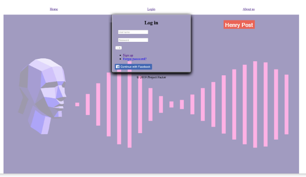
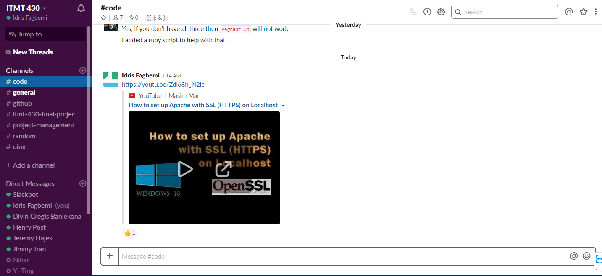

# Report

### Project Manager: Idris Fagbemi
### Developer: Divin Gregis Baniekona
### Junior Developer: Jimmy Tran
### IT Operation: Yi-Ting Lin
### UI/UX: Nihar Patel and Henry Post

#### 1. Language and framework of your choice:
Java and Kotlin as our languages for developing the web server logic
Java Server Faces (JSF) for presenting our web application logic
Spring Boot as an ‘inversion of control’ framework to simplify configuration
Hibernate as an ORM engine to simplify CRUD operations. We use JDBC as the connection driver for Hibernate

#### 2. Operating System Platform of Choice:
The OS is Ubuntu server 16.04.
We use Apache Tomcat, Java 9, and MySQL Server.
Currently, there is no secret management.
However, all passwords and other information is easy-to-locate, standardized, and will be easy to change.
There is also no application metrics capture yet.

#### 3. Use of Data Store/Storage:
Using MySQL to store user information, names, emails, etc.
We are planning on using iSCSI along with file paths to handle storing videos.
A table will be created to store information about the videos
(ID, Title, date of creation…) as well as a field that will contact the path to access the video.
We currently have the ORM engine working and can store a “Person” object without writing any SQL code.
We have the MySQL server on a completely separate box.
A separate box has been created to be a iSCSI target and act as a video storage server.
The Web server will be configured as a iSCSI initiator so it will connect to the storage server which will act as a SCSI hard drive

#### 4. Data encrypted at rest:
Data is currently stored in plaintext in the MySQL database.
Data encryption at rest is planned.
Truecrypt for full disk encryption is also a good option to add to our security.

#### 5. Database makes use of master/slave replication:
A single schema, there is currently no caching layer, and we use a single MySQL database.
As the database is separated, it makes making master/slave boxes easier.

#### 6. Use of Responsive design:
Using CSS to build multi platform of different scale monitor screens for clients.
We havne't build the style for smaller screen devices.

#### 7. Use of https:
We currently have no certificates or self-signing mechanism.
We are using JavaServer Faces (JSF) alongside a Server Filter and Session Managed Bean to authenticate users and ensure that only authenticated users may access certain pages.
Our login authentication mechanism is currently working and authenticates to our database to provide access. This was done through Hibernate Query Language (HQL).
We have port 8080 open for HTTP.
We do seed the database with 15 test users.
We are making use of mkcert

#### 8. Use of user authentication:
There is a session in the form of cookies, but no logic to differentiate users as sessions yet, but is currently being configured by pairing UserID with SessionID.
Hibernate query is used to validate username and password from MySQL Database to allow user authentication.
The UI could easily be modified for authentication / un authentication users via CSS selectors.

#### 9. Creation of Dev Environment (local laptop):
The development environment is well-documented, but is not automatically creatable.
The instructions are in the form of a markdown file.
All of our packer build scripts work.
`vagrant up` works.
The development environment uses GitHub deploy keys, and everyone deploys using their own keys.

#### 10. Layout design:
This is our website layout.
At top has all the navigations, which direct you to different pages.

#### 11. Management of Visio (or comparable) diagram tool of work flow:
This is the front-end website workflow.

This is the user experience flow.

This is the website server UML diagram.

This is the Deploy keys

#### 12. Management of project progress:
a. [Trello](https://trello.com/b/03OdRjtq/2019-team-07f)

b. [Slack](https://itmt-430-group.slack.com)

c. [GitHub](https://github.com/illinoistech-itm/2019-team-07f)

d. GitHub Issues to resolve bug posts from UI/UX tester

#### Trello Board:

#### Slack:

#### 13. Team must generate at least 15 real “test” user data that is inserted upon instance creation and proper data to test functionality of a system:
We currently have 15 test users.
There are connection self-tests that the web box will perform with both the database box and storage box.
These are performed each time

