# Roles

Project Manager: Jimmy Tran

Developer: Idris Fagbemi, Yi-Ting Lin

Junior Developer: Nihar Patel

IT Operation: Henry Post

UI/UX: Divin Baniekona

# 1. Languages and Frameworks

## a. Programming Language and Language Framework

### Java JDK 1.8.0_191 and Kotlin 1.3

Java is primarily used for our web server logic, our modeling business objects,
and to present our data.

Kotlin is used in our project because it works very well alongside Java.

Kotlin provides syntax shortcuts and more functions that may be used with existing
Java .class objects.

### Java Server Faces 2.1

Java Server Faces (JSF) is used to present our web application logic.

JSF provides better security benefits and the platform to easily create complex xHTML
elements.

### Apache Tomcat 8 and 9

Apache Tomcat is used to deploy our web application locally for development and testing.

Apache Tomcat 8 is being used in our Virtual Machines while our development is done in
Apache Tomcat 9 web server.

### Spring Boot

Spring Boot is used to make configurations more simple.

Spring Boot gathers all of our configuration files and implements them in a file called
'applicationContext.xml'.

### Hibernate / Hibernate Query Language (HQL)

Hibernate is used as an Object Relational Mapping engine for CRUD (Create, Read, Update Delete)
operations and is the link between our database and our web application.

Hibernate uses annotations on Java Objects and inserts them into a database table.

Hibernate also uses SQL queries for CRUD operations, also known as Hibernate Query Language.

Java Database Connectivity (JDBC) is used as the connection driver for Hibernate so that
we may connect to our MySQL database.

# 2. Operating System Platform of Choice

## a. Which Operating System and Why?

The current Operating System is running on Ubuntu Server 16.04 for all of our Virtual Machines.

We chose Ubuntu Server OS because of how easy it is to configure and use.

## b. Packages - List All Additional Packages Installed

General-purpose tools

    git \
    tmux \
    curl \
    gtop \
    lynx

General tools for the developers.

Automatic installation

    software-properties-common \
    debconf-utils

Auto-installation of packages that prompt users for input.

Languages/Frameworks

    default-jdk \
    maven \
    python3.6 \
    tomcat8 \
    mysql-client \
    mysql-server-5.7

#### i. Operating System Packages such as .deb

[Web-Packages](img/web-packages.txt)
[DB-Packages](img/db-packages.txt)
[Storage-Packages](img/storage-packages.txt)

## c. Language/Framework Packages

Our 'pom.xml' file is where our required Java packages are.

We use Java Server Faces for front-end presentation,
Servlet Filters for authentication,
ffmpeg for converting media files,
Hibernate for Object Relational Mapping (ORM), and
MySQL connectors for database.

List of Current Packages from 'pom.xml'

    black.ninia:jep:3.8.2
    ch.qos.logback:logback-classic:1.0.13
    com.example:jep-example:1.0-SNAPSHOT
    com.jolira:onejar-maven-plugin:1.4.4
    com.sun.el:el-ri:1.0
    commons-dbcp:commons-dbcp:1.4
    commons-io:commons-io:2.6
    edu.cmu.sphinx:sphinx4-core:5prealpha-SNAPSHOT
    edu.cmu.sphinx:sphinx4-data:5prealpha-SNAPSHOT
    javax.inject:javax.inject:1
    javax.servlet.jsp:javax.servlet.jsp-api:2.3.3
    javax.servlet:javax.servlet-api:4.0.1
    javax.xml.bind:jaxb-api:2.2
    mysql:mysql-connector-java:8.0.12
    net.bramp.ffmpeg:ffmpeg:0.6.2
    org.apache.maven.plugins:maven-compiler-plugin:3.5.1
    org.apache.maven.plugins:maven-jar-plugin:null
    org.apache.maven.plugins:maven-war-plugin:3.2.1
    org.apache.tomcat.maven:tomcat7-maven-plugin:2.2
    org.aspectj:aspectjrt:1.7.4
    org.codehaus.mojo:exec-maven-plugin:1.2.1
    org.glassfish:javax.faces:2.2.18
    org.hibernate:hibernate-core:5.2.12.Final
    org.hibernate:hibernate-entitymanager:5.2.12.Final
    org.jetbrains.kotlin:kotlin-maven-plugin:1.3.11
    org.jetbrains.kotlin:kotlin-stdlib:1.3.11
    org.slf4j:slf4j-api:1.7.5
    org.springframework.boot:spring-boot:2.1.3.RELEASE
    org.springframework:spring-core:5.0.2.RELEASE
    org.springframework:spring-orm:5.0.2.RELEASE
    org.springframework:spring-tx:5.0.2.RELEASE
    org.springframework:spring-webmvc:5.0.2.RELEASE
    searchable-video-library:searchable-video-library:0.0.1-SNAPSHOT
    xuggle:xuggle-xuggler:5.4

## d. Implementation and Collection of Application Metrics and Monitoring

There is a `Jenkinsfile` at the root of the repo that will build, deploy, and test this
repository's code commits.

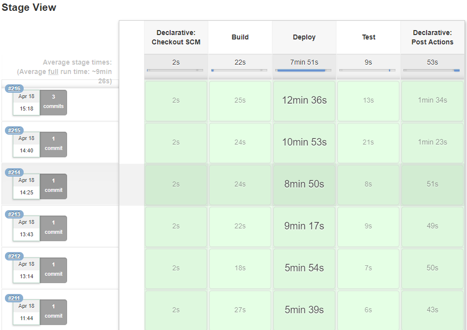

Application Metrics are currently captured for all virtual machines.

Both netdata and the html file '/2019-team-07f/metrics/three_servers.html' is our centralized
place to monitor the performance and stability of our application.

Netdata graphs may be seen at their respective links.

localhost:19999
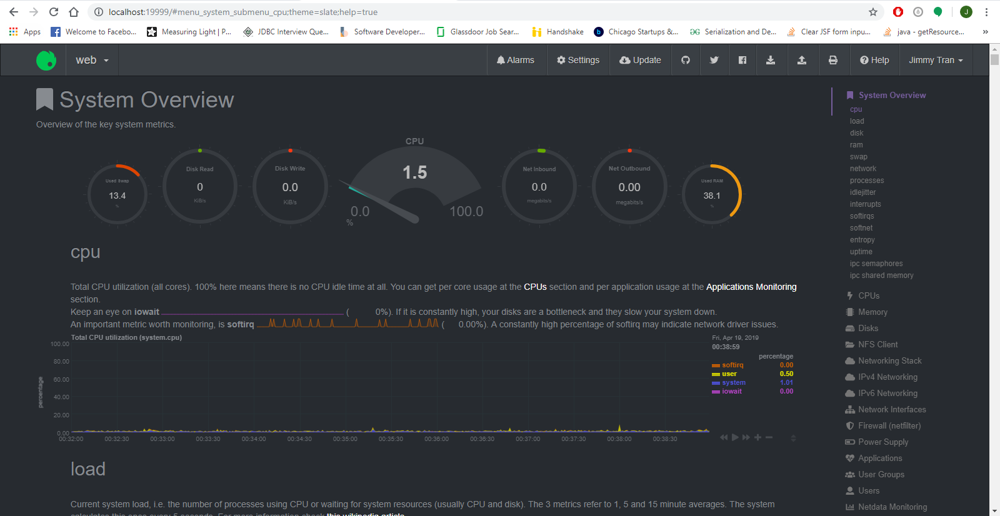

localhost:19998


localhost:19997
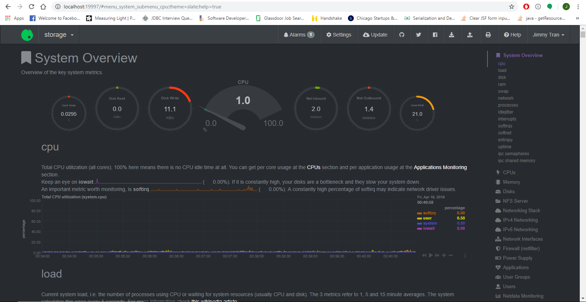

These graphs may be seen by opening up three_servers.html in the team metrics folder.

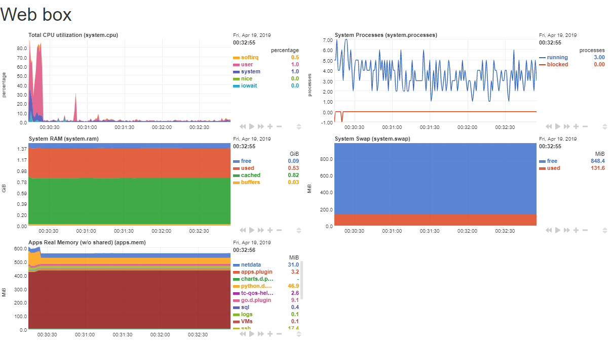
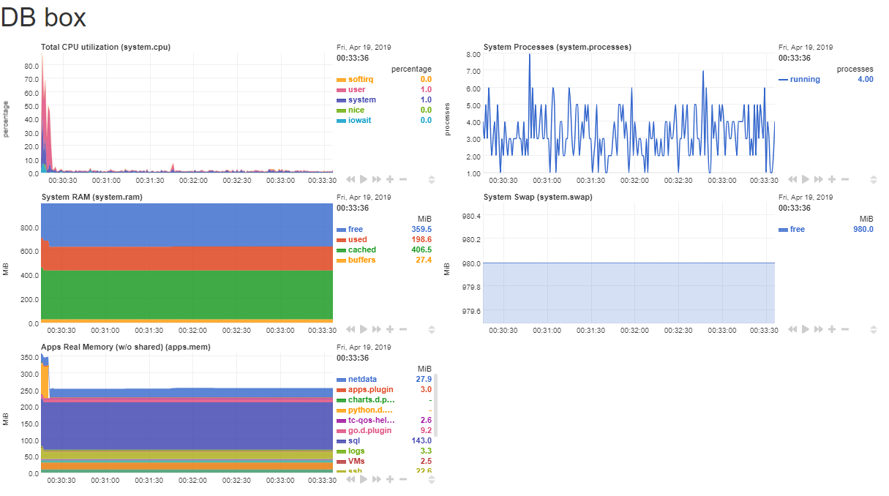
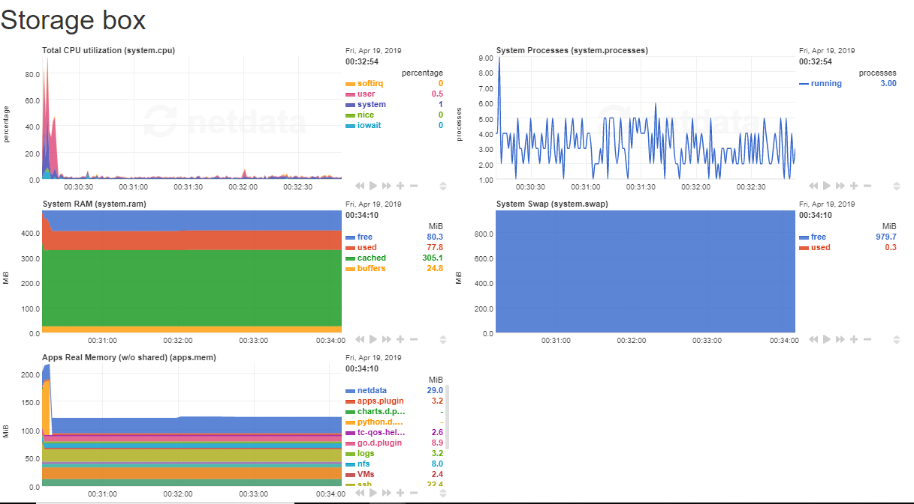

## e. Destroy Script

Script command: `ruby destroy-everything.rb -f` (must have Ruby installed)

With the '-f' flag, it will force (automatically confirm) through the confirmation prompt.

# 3. Use of Data Store/Storage

## a. Databse or Similar Storage Technology

We are currently utilizing MySQL 5.7 as our database to store all user information such as
usernames, names, emails, passwords, and etc.

Our MySQL server is separated into it's own virtual box.

We are also currently using NFS to store all media files such as MP3/MP4 files.

NFS is also separated onto it's own virtual box and acts as our file storage.

A table called Video has been created to store video information such as ID, Title, Details,
Type, and Size.

Other tables such as Audio, Text, and Details were also created to store
respective information.

Since we are using Hibernate, we can store a "Person" object without any SQL code/queries.

# 4. Data Encryption at Rest

Information/data is currently stored in the MySQL database in plaintext view.

All new user passwords are hashed and salted.

Data Encryption at rest is still planned for future implementation.

# 5. Database Makes Use of Master/Slave Replication:

## a. Schema Creation

We are using a single MySQL database with a single schema.

## b. Caching Layer Implementation

We currently have no caching layer.

## c&d. Master for Database Writes & Slave for Database Reads

Since the database is separated, it makes making master/slave boxes easier.

# 6. Use of Responsive design

## Explain What Framework Allows for Responsive Design in your Project

We are not using any framework for responsive design.
We are utilizing plain CSS skills to achieve a clean and smooth responsive interface.

Plain CSS is used to build responsive screens. We are using mobile-first designs and use
relative units and relative positioning to allow our interface to adapt to all screen sizes.


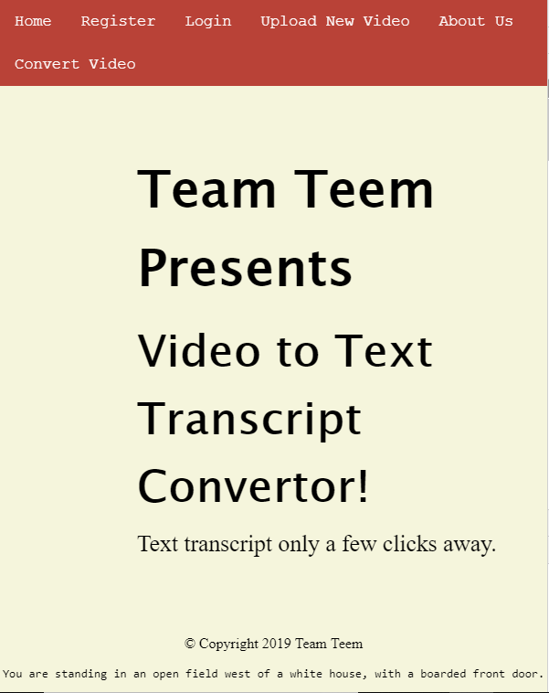

# 7. Use of HTTPS

## a. Self-signed Certificates

We currently still do not have any certificates or self-signing mechanism.

## b. Login Authentication Mechanism

### i. Describe How You Are Doing This

We are using Java Server Faces (JSF) alongside a Server Filter and a Session Managed Bean
to authenticate users and ensure that only authenticated users may access certain pages.

Our login authentication mechanism is currently working and authenticates to our
database with correct user login information.
This was done through Hibernate Query Language (HQL).

### ii. Describe How You Are Securing This

The username is stored in a Java Servlet Session that the user can identify via a cookie.

There is built-in Cross-site Request Forgery (CSRF) protection in the form of a
cryptographic nonce that gets inserted with all forms.

## c. Explanation of Security Assumptions

### i. Firewall

We have only port 8080 open for HTTP.

### ii. Authentication Keys

Authentication keys are to be stored in `~/.ssh/id_rsa` on the host.

These are RSA private keys.

They are copied to the VM's disk and used to clone the git repository.
Thereafter, they are removed from the virtual machine.

### iii. Seeding of Usernames and Passwords

We have seeded the database with 15 test users.

```sql
    INSERT INTO `person` (country, email, name, password, username)
    VALUES ('USA', 'hpost@hawk.iit.edu', 'Henry Post', 'forkbomb123', 'hpost'),
           ('USA', 'npatel117@hawk.iit.edu', 'Nihar Patel', 'pmsrock!!', 'npatel117'),
           ('USA', 'ifagbemi@hawk.iit.edu', 'Idris Fagbemi', 'dev4life', 'ifagbemi'),
           ('USA', 'dbaniekona@hawk.iit.edu', 'Divin Gregis Baniekona', 'itopsguy456', 'dbaniekona'),
           ('USA', 'ylin95@hawk.iit.edu', 'Yi Ting Lin', 'yitingrox', 'ylin95'),
           ('USA', 'jtron82@hawk.iit.edu', 'Jimmy Tran', 'uiuxuxui', 'jtron82'),

           ('Dominican Republic', 'carrjess21@gmail.com', 'Jessie Caraballo', 'carrain$!', 'jessiecar2'),
           ('Albania', 'vgoj@gmail.com', 'Victor Gojcaj', 'nycisforme', 'vgoj'),
           /*(...)*/
```

### iv. Pre-seeding Databases with Schema and Records

We have an SQL script that creates a schema called 'searchable-video-library' when executed.

All the tables are created from Plain Old Java Objects (POJOs) with Hibernate annotations
and are created at runtime of the Apache servlet.

```java

    package com.teamteem.model;

    import javax.faces.bean.ManagedBean;
    import javax.persistence.*;
    import java.util.Set;

    @Entity
    @Table(name = "person")
    @ManagedBean(name = "person")
    public class Person {

        @Id
        @Column(name = "id")
        @GeneratedValue(strategy = GenerationType.IDENTITY)
        private int id;

        private String name;

        @Column(unique = true)
        private String username;

        @Column(unique = true)
        private String email;

        private String country;

        private String password;

        @OneToMany(mappedBy = "person")
        private Set<Video> videos;

        @OneToMany(mappedBy = "person")
        private Set<Audio> audios;

        @OneToMany(mappedBy = "person")
        private Set<Text> texts;

        //(...)

    }
```


# 8. Use of User Authentication

## a. Must use HTTP/webserver Session

User sessions work by saving a username to a `jsessionid`.

This allows an authenticated user to have a session after logging in with a valid
username and password.

## b. Different UI for Unauthenticated Users

The UI for Unauthenticated Users is the same for Authenticated Users.

## c. Different UI for Authenticated Users

The UI for Authenticated Users is the same for Unauthenticated Users.

## d. Different UI for Administrative Users

The UI for Administrative User is the same as Unauthenticaed and Authenticated Users.

## e. UI is Modified per Authenticated User via CSS

The UI is the same for all users.

# 9. Creation of Dev Environment (local laptop):

## a) Must Work According to Specification

Setting up an IDE as well as specific versions for required software are documented.

The development environment is not created automatically but is documented.

Running `ruby /packer/build-missing.rb` will build all missing packer boxes.
Running `vagrant up` in `/` will bring the virtual machines up.

## b) Environment Must Be Configurable via a Script Pre-Deploy

All global configuration are stored in `/variables.yml`

## c) Explanation of UI/UX Testing Methodology

As of now we only test and report bugs in UI/UX components.

## d) GitHub Bug Reports & Trello Closed Bug Report Card Proof

Although some bugs were corrected this sprint, none of which were recorded.

# 10. Layout Design

## a&b. Diagrams of Site Functionality & Other Usability Features

This is the home page layout of our website.

At the top of the page, there is a navigation bar to guide users through different pages.


This is our registration page.

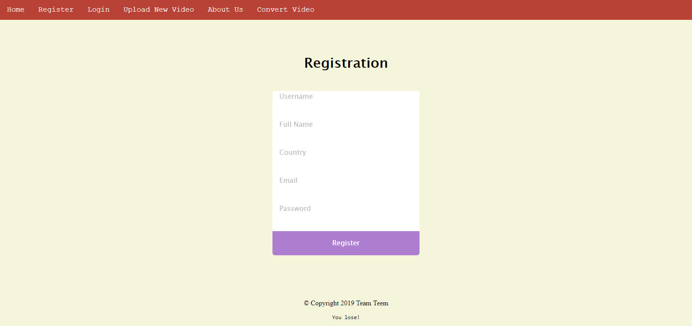

This is our login page.
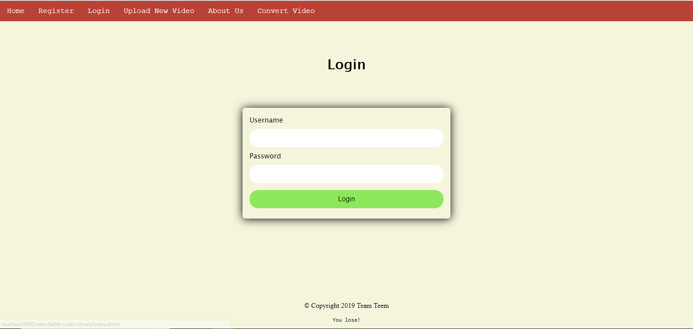

This is our upload file page.


## 11. Management of Diagram Tool of Work Flow

Front-end Website Workflow.


User Experience Workflow.


Web Server UML Diagram.


# 12. Management of Project Progress

## a. Trello

[Trello link](https://trello.com/b/03OdRjtq/2019-team-07f)

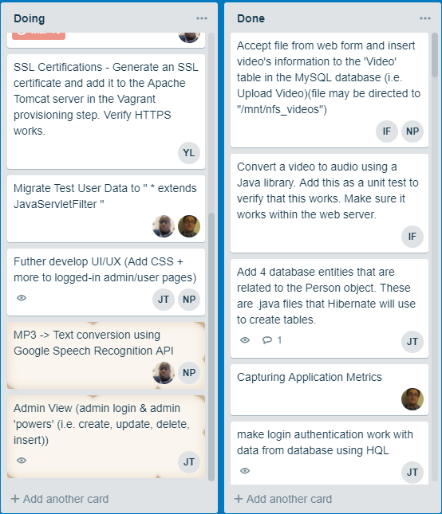

## b. Slack

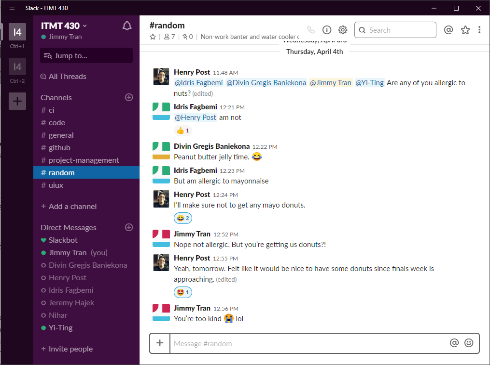

## c. Development Environment

Our development environment cross-plateform and is documented in `/README.md` and `/server/README.md`.

## d. GitHub - Correlate Completed Goals to GitHub Commits

### Capturing Application Metrics & Setup and Mount the NFS Storage

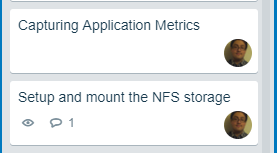

https://github.com/illinoistech-itm/2019-team-07f/commit/cdf6ebc1b45a4b3006c1dbe201dfbd25cf5d65a8

https://github.com/illinoistech-itm/2019-team-07f/commit/28d96d94abd7265385e6f1d9096e8073159a4d7b

https://github.com/illinoistech-itm/2019-team-07f/commit/f10b93b179798497f49827a4a5eb561c6e6d1ecd

https://github.com/illinoistech-itm/2019-team-07f/commit/fd7d50cd6919a7c4c6a94d1513436a67d5933ea5

### Attempt to Generate SSL and Add it to Apache Tomcat Server in Vagrant


https://github.com/illinoistech-itm/2019-team-07f/commit/925e2781c77f5880d2409aaa71092a5c44bb72d6

https://github.com/illinoistech-itm/2019-team-07f/commit/3a75534896d5baf5ee21b96e5f074d12a6a02287

https://github.com/illinoistech-itm/2019-team-07f/commit/d7f6edde99b2ff167494e5873f9eea4b7aa2ffbc

### Direct Uploaded Files to '/mnt/nfs_videos'


https://github.com/illinoistech-itm/2019-team-07f/commit/d15ee4966e319de5af2becf3e8181f952efda8df

https://github.com/illinoistech-itm/2019-team-07f/commit/9e1eed79218a483248101fb6b316fafb6dfb2375

https://github.com/illinoistech-itm/2019-team-07f/commit/c475fb565ed0864a79edf636468b4725eb70b2ad

### Further Developing Web Application UI/UX


https://github.com/illinoistech-itm/2019-team-07f/commit/f7efe9f15441f7e3fb3472aca794355f95a4753d

https://github.com/illinoistech-itm/2019-team-07f/commit/15537020da74b20b307d31b1df78429117cc05b5

https://github.com/illinoistech-itm/2019-team-07f/commit/4d07e08727fb079bd506b5df61cd3fef43dbed4d

### Convert Audio to Text using Google Speech Recognition API


https://github.com/illinoistech-itm/2019-team-07f/commit/50756d81eac8c4e84dd3fa9adbfc8f271f0080ee

https://github.com/illinoistech-itm/2019-team-07f/commit/a2888e581af5f74adb4a0a827a9efb8b7fecb4a0

https://github.com/illinoistech-itm/2019-team-07f/commit/47694a47254516f83bedd3047c8426905b99b5e6

## e. GitHub Issues

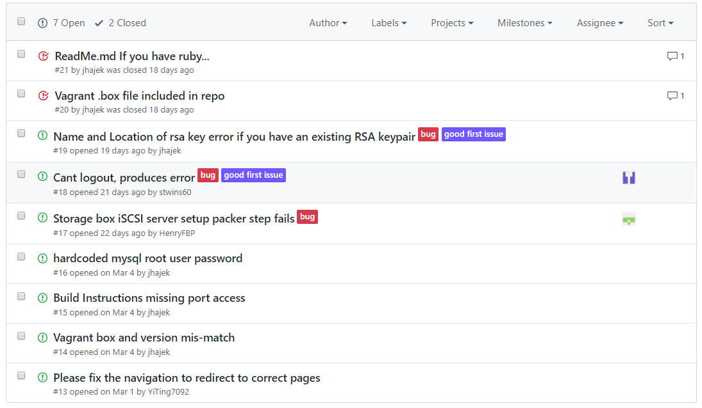

# 13. Insertion of Test Users Upon Application Deployment

15 Test users get inserted into the database when the application is deployed.
